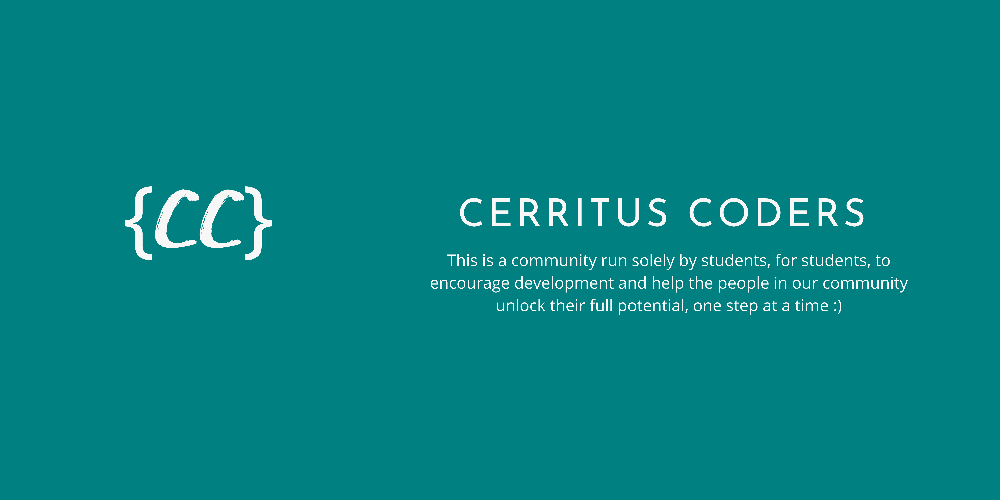

  
  <h1>Cerritus Coders</h1>
  

    
  

## About Us

### Q) What is our community?

A) It is a student-run community focusing on open source, project-based learning.

### Q) What is our community for?

A) This community is run solely by students, for students, to encourage development, open-source, and help the community unlock their full potential, one step at a time. 

### Q) What is our Mission? 

A) We aim to help folks to get opportunities by encouraging them to learn, build and share in public.

### Q) When was this community founded?

 A) Our community was created on the 18th of December 2021 and we started it to help a bunch of classmates to get started with open source and project based learning. Since then we have just grown and we are really proud of our growth!

#### Underneath you will find more information about the server and our community! Feel free to contact one of our staff members if you have a question after reading this! 
[COC](https://github.com/CerritusCodersComm/CerritusCodersComm/blob/main/CodeOfConduct.md) 
